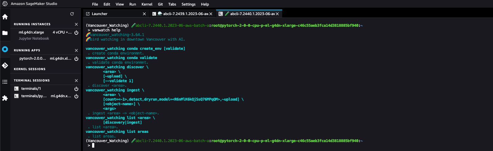

# Vancouver Watching (`vanwatch`) 🌈

`vanwatch` 🌈 discovers and ingests images from traffic cameras in an area and then runs [YOLO 🚀](https://github.com/ultralytics/ultralytics) and other vision algo to extract information about urban activity at scale. 


```bash
 > vanwatch help
🌈 vancouver_watching-3.89.1
🌈 bird watching in downtown Vancouver with AI.

vanwatch conda create_env [validate]
 . create conda environmnt.
vanwatch conda validate
 . validate conda environmnt.
vanwatch discover \
	[area=vancouver|iran,~upload] \
	[-|<object-name>] \
	[<args>]
 . discover area -> <object-name>.
vanwatch ingest \
	[area=vancouver|iran,count=<-1>,dryrun,~upload] \
	[-|<object-name>] \
	<args>
 . ingest <area> -> <object-name>.
vanwatch list [area=vancouver|iran,discovery|ingest]
 . list objects from area.
vanwatch list areas
 . list areas.
vanwatch process \
	[~download,model=<R6nMlK6kQjSsQ76MPqQM>,~upload] \
	[.|<object-name>] \
	[<args>]
 . process <object-name>.
```

## Discover and Ingest an Area


To see the list of areas supported by `vanwatch` type in,

```bash
vanwatch list areas
```

To discover the available cameras in an area type in,

```bash
vanwatch discover area=vancouver
```

You have generated a `geojson` of [traffic images in the City of Vancouver](./data/vancouver.geojson). Now, you can ingest the traffic images from this area and detect people and cars in them,

```bash
vanwatch ingest area=vancouver,count=2,process
```


model: https://hub.ultralytics.com/models/R6nMlK6kQjSsQ76MPqQM?tab=preview


## set-up

```bash
abcli git clone Vancouver-Watching install
```

To use the [Ultralytics API](https://hub.ultralytics.com/models), browse [this page](https://hub.ultralytics.com/settings?tab=api+keys) and copy your API key, then run,

```bash
@cookie write ultralytics.api.key <api-key>
```

To use on [AWS SageMaker](https://aws.amazon.com/sagemaker/), generate the seed 🌱,

```bash
@seed sagemaker
```

Then change the environment to a `PyTorch 2` image, `Python3` kernel, `ml.g4dn.xlarge` instance, and "open image terminal". Then, type in `bash` and paste the seed 🌱. Then, run,

```bash
vanwatch conda create_env validate
```

