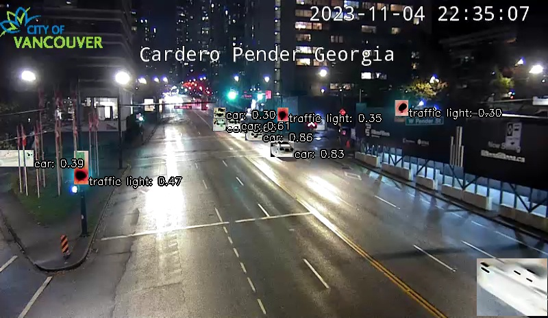

# Vancouver Watching (`vanwatch`) 🌈

`vanwatch` 🌈 discovers and ingests images from traffic cameras in an area and then runs [YOLO 🚀](https://github.com/ultralytics/ultralytics) and other vision algo to extract information about urban activity at scale. 


```bash
 > vanwatch help
🌈 vancouver_watching-3.155.1
🌈 bird watching in downtown Vancouver with AI.

vanwatch conda create_env [validate,~recreate]
 . create conda environment.
vanwatch conda validate
 . validate conda environment.
vanwatch discover \
	[area=<area>,~upload] \
	[-|<object-name>] \
	[<args>]
 . discover area -> <object-name>.
vanwatch ingest \
	[area=<area>,count=<-1>,dryrun,gif,model=<model-id>,~process,publish,~upload] \
	[-|<object-name>] \
	[<args>]
 . ingest <area> -> <object-name>.
vanwatch list [area=<area>,discovery|ingest,published] \
	[--count <count>] \
	[--delim space] \
	[--log 0] \
	[--offset <offset>]
 . list objects from area.
2 area(s): iran,vancouver
vanwatch list areas
 . list areas.
vanwatch process \
	[~download,gif,model=<model-id>,publish,~upload] \
	[.|<object-name>] \
	[<args>]
 . process <object-name>.
vanwatch update_QGIS [area=<area>,push]
 . update <area> in QGIS.
vancouver_watching test \
	[dryrun,~ingest,~list,~process,upload]
 . test vancouver_watching.
```

## Discover and Ingest an Area


To see the list of areas supported by `vanwatch` type in,

```bash
vanwatch list areas
```

To discover the available cameras in an area type in,

```bash
vanwatch discover area=vancouver
```

You have generated a `geojson` of [traffic images in the City of Vancouver](./data/vancouver.geojson). Now, you can ingest the traffic images from this area and detect people and cars in them,

```bash
vanwatch ingest area=vancouver,count=2,publish
```



model: https://hub.ultralytics.com/models/R6nMlK6kQjSsQ76MPqQM?tab=preview

[](./QGIS/vancouver-2023-11-12-12-03-40-85851.geojson)


---

To use on [AWS SageMaker](https://aws.amazon.com/sagemaker/) replace `<plugin-name>` with `vanwatch` and follow [these instructions](https://github.com/kamangir/blue-plugin/blob/main/SageMaker.md).