# 🌈 Vancouver Watching (`vanwatch`)

`vanwatch` 🌈 runs [YOLO 🚀](https://github.com/ultralytics/ultralytics), [OpenAI Vision](https://github.com/kamangir/openai-commands/tree/main/openai_commands/vision), and other AI algo on traffic cameras to extract timeseries of urban activity at scale.


```bash
pip install vancouver-watching
```

|   |   |
| --- | --- |

```mermaid
graph LR
    discover["vanwatch<br>discover<br>target=&lt;target&gt;<br>&lt;object-name&gt;"]
    object1["📁 object"]:::folder
    ingest["vanwatch<br>ingest<br>target=&lt;target&gt;<br>&lt;object-name&gt;"]
    detect["vanwatch<br>detect<br>gif,publish<br>&lt;object-name&gt;"]
    ingest_detect["vanwatch<br>ingest<br>target=&lt;target&gt;<br>&lt;object-name&gt;<br>detect,gif,publish"]
    object2["📁 object"]:::folder

    discover --> object1

    object1 -- "#tag" --> ingest
    ingest --> object2

    detect --> object2
    object2 --> detect

    object1 -- "#tag" --> ingest_detect
    ingest_detect --> ingest
    ingest_detect --> detect

    classDef folder fill:#999,stroke:#333,stroke-width:2px;
```

| [`time-series`](https://kamangir-public.s3.ca-central-1.amazonaws.com/vanwatch-cache-2024-02-28-21-04-19-26236.tar.gz) [](https://kamangir-public.s3.ca-central-1.amazonaws.com/vanwatch-cache-2024-02-28-21-04-19-26236.tar.gz) `vanwatch-cache-2024-02-28-21-04-19-26236` | [`last build`](https://kamangir-public.s3.ca-central-1.amazonaws.com/test_vancouver_watching_ingest/animation.gif?raw=true&random=izyom7bqfc3wkcv2) [](https://kamangir-public.s3.ca-central-1.amazonaws.com/test_vancouver_watching_ingest/animation.gif?raw=true&random=izyom7bqfc3wkcv2)  |




---


[](https://github.com/kamangir/vancouver-watching/actions/workflows/pylint.yml) [](https://github.com/kamangir/vancouver-watching/actions/workflows/pytest.yml) [](https://github.com/kamangir/vancouver-watching/actions/workflows/bashtest.yml) [](https://pypi.org/project/vancouver-watching/) [](https://pypistats.org/packages/vancouver-watching)

built by 🌀 [`blue_options-4.229.1`](https://github.com/kamangir/awesome-bash-cli), based on 🌈 [`vancouver_watching-3.507.1`](https://github.com/kamangir/vancouver-watching).

