# 🌈 Vancouver Watching (`vanwatch`)

`vanwatch` 🌈 runs [YOLO 🚀](https://github.com/ultralytics/ultralytics), [OpenAI Vision](https://github.com/kamangir/openai-commands/tree/main/openai_commands/vision), and other AI algo on traffic cameras to extract timeseries of urban activity at scale.


```bash
pip install vancouver-watching
```

--table--

```mermaid
graph LR
    discover["vanwatch discover target=<target> <object-name>"]
    object1["📁 object"]:::folder
    ingest["vanwatch ingest target=<target> <object-name>"]
    detect["vanwatch detect gif,publish <object-name>"]
    ingest_detect["vanwatch ingest target=<target> <object-name> detect,gif,publish"]
    object2["📁 object"]:::folder

    discover --> object1

    object1 -- "#tag" --> ingest
    ingest --> object2

    detect --> object2
    object2 --> detect

    object1 -- "#tag" --> ingest_detect
    ingest_detect --> ingest
    ingest_detect --> detect

    classDef folder fill:#999,stroke:#333,stroke-width:2px;
```




---

--signature--
