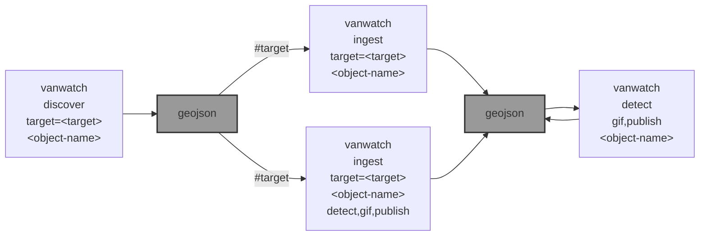

# 🌈 Vancouver Watching (`vanwatch`)

`vanwatch` 🌈 runs [YOLO 🚀](https://github.com/ultralytics/ultralytics), [OpenAI Vision](https://github.com/kamangir/openai-commands/tree/main/openai_commands/vision), and other AI algo on traffic cameras to extract timeseries of urban activity at scale.


```bash
pip install vancouver-watching
```

```bash
@select
vanwatch ingest \
	area=vancouver,count=4 . \
	detect,gif,publish
@open QGIS .
```

--table--




---

--signature--
